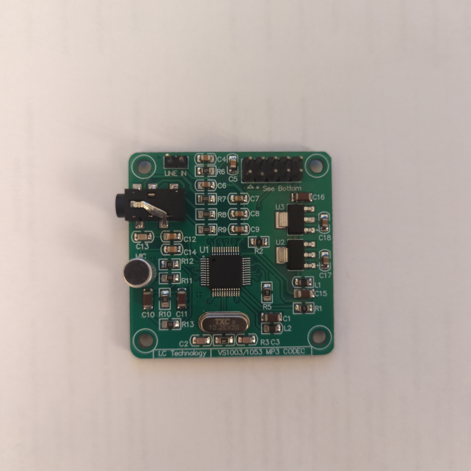

# VS1053 driver

This is a SPI driver for the generic **[VS1053 Breakout](http://www.vlsi.fi/en/products/vs1053.html)** by VLSI Solution. 
A powerful Ogg Vorbis / MP3 / AAC / WMA / FLAC / MIDI Audio Codec chip. 
Read more: [http://www.vlsi.fi/en/products/vs1053.html](http://www.vlsi.fi/en/products/vs1053.html).

## Example board:

Based on https://github.com/baldram/ESP_VS1053_Library 
For detailed information please see [VS1053b Datasheet specification](http://www.vlsi.fi/fileadmin/datasheets/vs1053.pdf).

The device does not play nice with other devices on the same SPI bus. 
It needs full access of cs line to configure its mode. 
The SPI bus speed should be limited during the setup steps. 
So It is recommended to use a separate SPI bus if you have  
more devices that are connected on SPI bus

## Example:
For complete code please check [examples](https://gitlab.com/esp322054205/vs1053/tree/master/examples) folder.

For a bigger example you can also see my project here
https://gitlab.com/esp322054205/esp32s3-radio-vs1053